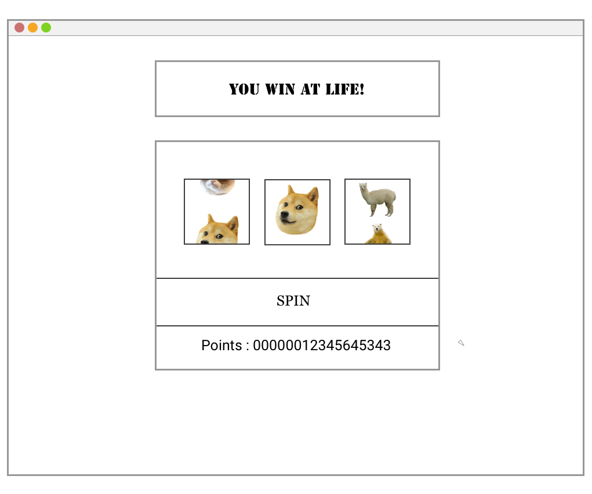

# SLOTS

### Wireframes:

A stress-free version of slots.
Desktop and mobile version.
Mobile is viewed horizontally for readibility and swiping function.

### User Stories:

User would...
1. press down on space bar to spin the slot machine.

2. see the 3-reel slot machine automatically spin and stop the spinning by letting go of the space bar.

3. watch the points grow into infinity!

### Pseudocode:

* Initiate by showing 3 blank slot reels wrapped inside a container

* After button is clicked (event listener)
    * click to trigger spin
    * animate spin and sound
    * set interval for counting down to stop spinning

* Matching tiles would trigger win/loss by acculumating or losing points.
    * random tiles selected
    * winning combos are 3 of the following:
        - doge : 100 pts 
        - alpaca: 80 pts
        - bear : 60 pts
        - grumpy : 20 pts
    * the probility of getting 3 doges is the lowest
    * potential bonus that has yet to be implemented: if you get all 3 grumpy cats, you lose EVERYTHING. 

* Winning match triggers win event (animations/sound)
    otherwise it does nothing