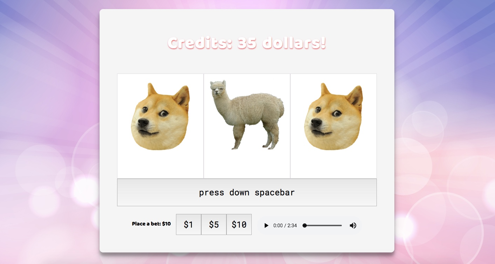

# SLOTS

A doge-y twist to a classic game of slots. 

*Disclaimer: No animals were harmed during this production.*

### 1. Lo-Fi Wireframe

______________________________________________

### 2. User Stories:

User would...
1. place a bet by clicking on button 1, 5, or 10 (USD).
2. press down on space bar to spin the slot machine.
3. see the 3-reel slot machine automatically spin and stop the spinning by letting go of the space bar.
4. get matching combo, then credit get added to total. Otherwise, loses bet.
5. loses the game if credit reaches zero.

______________________________________________

### 3. Pseudocode:

* Initiate by showing 3 blank slot reels wrapped inside a container
* Place a bet by clicking on the buttons
    * Total sum of is displayed
* While spacebar is held down:
    * Images cycle through like a spin effect
        * Weighting (number of outcomes or probability) of matches considered
    * Infinate amount of spins while holding down spacebar
* When spacebar is lifted, the reels stop and 
    * bet is deducted from credit sum with no matches
    * otherwise, bet is added with winning combo
* Matching tiles would trigger win/loss by acculumating or losing points.
* Things to consider: cannot deduct beyond zero dollars and credit stops at zero.
    * winning combos are 3 of the following:
        - doge : 5 pts 
        - alpaca: 4 pts
        - bear : 3 pts
        - grumpy : 1 pts
* Ability to continue playing, otherwise when credit reaches zero a msg appears

* Added bonus: included audio which users can play

______________________________________________
### 4. Future implemations: 

* Adding a modal that displays instructions for users

[Play with Doge and Friends here](https://hye-na.github.io/slots/)

